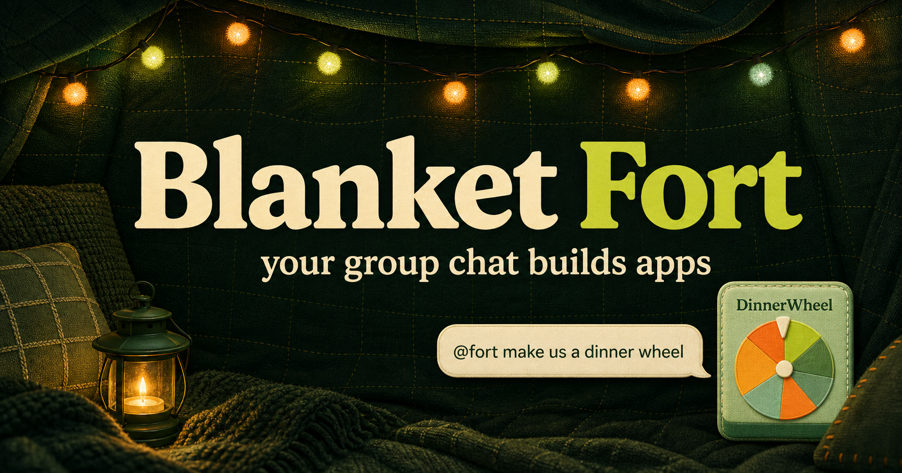
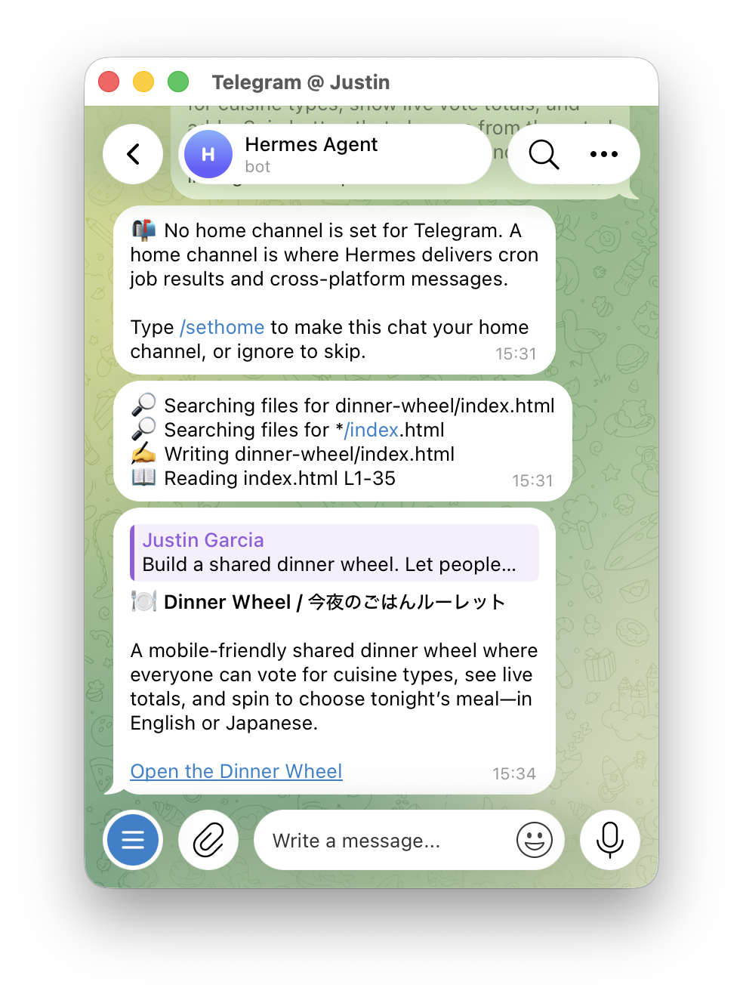

# Blanket Fort

> Your group chat builds apps.

**Codex is an incredible app builder. Blanket Fort makes it multiplayer.**

Blanket Fort lets non-technical friends create small, shared web apps from a
conversation they are already having. A group sends a request in Telegram or
Discord, [Hermes Agent](https://hermes-agent.org) brings it to Codex, and the
finished app returns to the chat as a public link.

The current prototype runs end to end in the cloud: Hermes, GPT-5.6 Sol, the
Telegram gateway, generated apps, and their shared backend are hosted on
Railway. The same gateway is configured for Discord once its deployment
secrets are supplied.



## Try the OpenAI Build Week submission

1. Visit the
   [product page](https://blanket-fort-hermes.littlebobert.chatgpt.site)
   for the concept and interactive group-chat demonstration.
2. Try the
   [permanent DinnerWheel demo](https://blanket-fort-hermes.littlebobert.chatgpt.site/demo/dinner-wheel)
   without installing Telegram or configuring a bot.
3. Open the
   [live generated-app hub](https://hermes-gateway-production-0aaf.up.railway.app).
4. Try
   [Mood Cloud](https://hermes-gateway-production-0aaf.up.railway.app/apps/mood-cloud/),
   an app generated by the cloud-hosted Hermes agent from a Telegram request.

The landing page and DinnerWheel are permanent hosted demonstrations. The
generated-app hub, Mood Cloud, and its shared state API are served by the live
Railway deployment.

## The idea

Most AI app builders begin with one person facing an empty prompt box. Blanket
Fort begins with a group conversation. The people, preferences, constraints,
and inside jokes are already there; the group can turn that context into a
small tool everyone can use.

Examples include:

- voting on dinner and spinning a shared wheel;
- finding a time that works for everyone;
- collecting the group’s mood as a live emoji cloud;
- creating a tournament bracket or lightweight party game.

Hermes supplies the agent runtime: messaging channels, sessions, model access,
and coding tools. Blanket Fort adds the multiplayer product layer: a bounded
workspace, an app publishing contract, shared state, and public URLs returned
to the conversation.

## Cloud build proof

The cloud-hosted Telegram agent received this request:

> Build a tiny shared mood-voting app called mood-cloud. Let each person choose
> an emoji mood, show live totals, and support English and Japanese.

Hermes created and validated the app inside Railway’s persistent workspace. The
result is available at the live
[Mood Cloud URL](https://hermes-gateway-production-0aaf.up.railway.app/apps/mood-cloud/),
and the public
[health endpoint](https://hermes-gateway-production-0aaf.up.railway.app/health)
reports it in the deployed app list.

The screenshot below captures the earlier DinnerWheel build through the same
Telegram and Hermes interaction model.



## Completed end-to-end flow

```text
Natural-language Telegram or Discord request
    |
    v
Hermes gateway on Railway
    |
    v
OpenAI Codex / GPT-5.6 Sol
    |
    v
Generate a mini app in a bounded persistent workspace
    |
    v
Validate the app and connect shared state when needed
    |
    v
Serve it at a public Railway URL
    |
    v
Return the finished app to the originating chat
```

Chat bots are allowlisted prototypes rather than open public bots. Public
visitors can use the generated apps, but strangers cannot spend the project’s
model allowance or invoke its tool-capable agent.

## What is implemented

- Hermes Agent v0.18.2 running continuously in its official Docker image on
  Railway.
- GPT-5.6 Sol through OpenAI Codex OAuth.
- A real Telegram bot and a Discord-ready Hermes gateway using the same cloud runtime.
- A persistent Railway volume for Hermes authentication, configuration,
  sessions, generated apps, and shared app state.
- A bounded `generated-apps/<slug>/` workspace governed by a tracked
  [`AGENTS.md`](generated-apps/AGENTS.md) publishing contract.
- Self-contained, mobile-friendly mini apps written as HTML, CSS, and
  JavaScript without a package installation or build step.
- Per-app metadata so the public hub can display the original prompt, title,
  description, and link for every future generated app.
- English and Japanese interfaces that default to the device UI language.
- One shared backend supporting:
  - per-user votes and live totals;
  - general shared app state;
  - server-selected spin results;
  - generated-app discovery and static delivery.
- Quiet Telegram and Discord configuration that keeps tool calls, validator
  output, design audits, and retry details out of group chat.
- A reproducible Railway startup script that applies both channel display
  policies and supervises the Hermes gateway and mini-app server.
- A permanent, judge-safe DinnerWheel hosted with the landing page.

## Messaging experience

The intended product contract is two chat messages:

1. an immediate acknowledgement with a build-monitor URL;
2. one final app link, or one concise unrecoverable error.

The prototype already suppresses Hermes tool progress, interim assistant
commentary, validator narration, and long-running heartbeat messages. The
job-specific monitoring page and receipt are the next product-layer addition;
they require a build-job service in front of Hermes rather than more prompting
inside the agent.

## Architecture

```text
Telegram or Discord
   |
   v
Hermes Agent gateway -- OpenAI Codex / GPT-5.6 Sol
   |
   | Railway persistent volume at /opt/data
   v
generated-apps/<slug>/
   |
   +-- index.html
   +-- app.json
   |
   v
Blanket Fort Node.js service
   |
   +-- GET  /api/apps/<slug>/state
   +-- PUT  /api/apps/<slug>/state
   +-- POST /api/apps/<slug>/votes
   +-- POST /api/apps/<slug>/spin
   |
   v
Public Railway app URL -- group members
```

The landing page is deployed separately through OpenAI Sites. Railway currently
hosts both the agent runtime and generated-app service, which keeps the
prototype small and makes the full loop independently accessible.

## Safety and scope

- Telegram access is restricted with `TELEGRAM_ALLOWED_USERS`.
- Discord requires an allowlisted user and channel plus an explicit `@Fort`
  mention; allow-all access is disabled by default.
- Hermes is instructed to work only inside `generated-apps/`.
- Generated apps never contain API keys, bot tokens, or other secrets.
- Apps are self-contained and cannot install arbitrary packages or expose their
  own servers.
- A stable browser-local ID lets the shared backend update one participant’s
  vote instead of counting repeated taps as additional people.
- Runtime-generated apps and state are gitignored; the publishing contract and
  infrastructure scripts are versioned.
- Railway secrets remain environment variables or Hermes credentials stored on
  the persistent volume.

## From prototype to product

The next version separates trusted build infrastructure from public app
delivery:

- Railway runs the API, job queue, Hermes build workers, and database.
- A build-job service sends the receipt and powers `/builds/<id>` monitoring.
- A GitHub App creates one repository per generated app using short-lived
  installation tokens.
- Cloudflare Pages automatically deploys each app from its repository.
- Cloudflare Workers with Durable Objects or D1 provide durable collaborative
  state.
- RevenueCat sells and tracks app-creation credits in the iPhone app.
- Customers can connect their own GitHub account and continue editing in Codex
  or Claude; changes pushed to `main` redeploy automatically.

`npm run publish-app -- <slug>` already prepares a generated app as a standalone
repository with GitHub Pages deployment, `AGENTS.md` for Codex, `CLAUDE.md` for
Claude, and configurable shared-backend support. Add `--push --owner=<owner>`
after authenticating GitHub CLI to create and push the public repository.

See [production-hosting.md](docs/production-hosting.md) for the deployment
design and Railway startup instructions.

## Repository map

```text
app/
  page.tsx                         Product landing page and chat simulation
  demo/dinner-wheel/page.tsx       Permanent interactive example
  globals.css                      Brand, responsive layout, accessibility
  layout.tsx                       Metadata and social sharing
miniapps/
  server.mjs                       App hub, state, votes, and spin API
scripts/
  publish-miniapp.mjs              Standalone repo and deploy preparation
  start-railway-hermes.sh          Reproducible Railway process startup
generated-apps/
  AGENTS.md                        Hermes app-building contract
  <slug>/                          Runtime-generated apps (gitignored)
docs/
  production-hosting.md            Cloud architecture and deployment notes
public/
  og.png                           Social preview
  telegram-build-proof.png         Telegram build evidence
.openai/
  hosting.json                     Landing-page hosting configuration
```

## Run locally

Requires Node.js `>=22.13.0`.

```bash
npm install
npm run dev
```

Then open [http://localhost:3000](http://localhost:3000).

Start the generated-app hub and shared backend separately:

```bash
npm run miniapps
```

Run validation:

```bash
npm test
```

## Railway

The Railway service uses the official Hermes image, mounts its persistent
volume at `/opt/data`, and starts the checked-out project with:

```bash
bash /opt/data/workspaces/blanket-fort/scripts/start-railway-hermes.sh
```

The startup script idempotently applies global quiet-output fallbacks plus
Telegram and Discord overrides before starting the mini-app server and Hermes
gateway. Redeploying the container therefore preserves the desired behavior,
while a fresh volume receives the same configuration automatically. Manual
`hermes config set` commands are not required after a clean deployment.

### Discord setup

Hermes owns the Discord transport, sessions, authorization, threads, and
response delivery; Blanket Fort does not run a separate Discord SDK or webhook.

1. In the [Discord Developer Portal](https://discord.com/developers/applications),
   create an application named **Fort** and use its bot user.
2. On the Bot page, enable **Server Members Intent** and **Message Content
   Intent**. Leave **Require OAuth2 Code Grant** off.
3. Install the bot to the private test server with the `bot` and
   `applications.commands` scopes. Grant only View Channels, Send Messages,
   Embed Links, Attach Files, Read Message History, Send Messages in Threads,
   and Add Reactions.
4. Enable Developer Mode in Discord, then copy the allowlisted user ID and the
   private channel IDs where builds may be requested.
5. Add these Railway variables without committing their values:

   - `DISCORD_BOT_TOKEN` — the bot token from the Developer Portal;
   - `DISCORD_ALLOWED_USERS` — comma-separated authorized Discord user IDs;
   - `DISCORD_ALLOWED_CHANNELS` — comma-separated private channel IDs.

The startup script supplies secure defaults: `DISCORD_ALLOW_ALL_USERS=false`,
`DISCORD_REQUIRE_MENTION=true`, `DISCORD_IGNORE_NO_MENTION=true`,
`DISCORD_ALLOW_BOTS=none`, `DISCORD_AUTO_THREAD=true`, and
`DISCORD_REACTIONS=false`. Railway may override these explicitly, but the
private prototype should keep them unchanged. The bot therefore ignores normal
channel chatter, unauthorized users, other bots, and all unlisted channels.
Each authorized `@Fort` request starts an isolated thread.

After redeployment, check `hermes gateway status`, send a non-mention that
should be ignored, then send `@Fort build a tiny test app` as an allowlisted
user. Verify that one final app link returns in the thread and that Telegram
continues to work. A private bot in a small number of servers does not require
Discord review; verification and privileged-intent review become relevant as
the bot approaches Discord's large-bot threshold.
